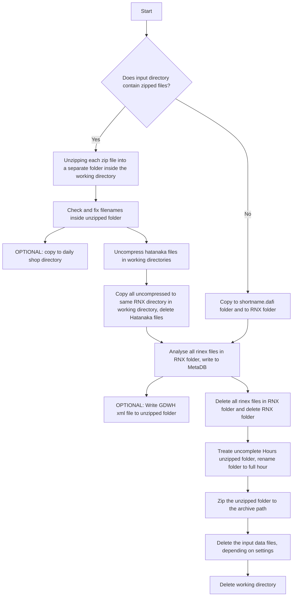

# service-rinexmetadatacontroller

Analyzes rinex data and stores the metadata in a SQLite DB and in an XML file.

## Summary

The service analyzes rinex 3.03 data and stores the metadata in a SQLite DB and in an XML.
All configuration parameters are listed in the configuration file App.config.
The rinexparsing is based on the repo sharov-am/Rinex-3.0-Parser. The adapted version is in forked into the repo Juerg-Liechti/Rinex-3.0-Parser.

## Dependencies

Prerequisites for development:
  * c# .Net Framework 4.5
  * System.Data.SQLite.Core -Version 1.0.111 (The official SQLite database engine for both x86 and x64 along with the ADO.NET provider.)
  * Rinex3Parser.dll (from https://github.com/Juerg-Liechti/Rinex-3.0-Parser)
  * crx2rnx.exe (from https://terras.gsi.go.jp/ja/crx2rnx.html)

To get the System.Data.SQLite.Core Package use nuget. PM> Install-Package System.Data.SQLite.Core -Version 1.0.111

## Flow Chart
### Processing a single day of a single input directory

